

  
  
  
  
  
  

  <picture>
    <source media="(prefers-reduced-motion: reduce)" srcset="assets/tentaculo-portada-sin-movimiento.png" />
    
  </picture>

  <picture></picture> 
  <picture>
    <source media="(prefers-reduced-motion: reduce)" srcset="assets/hastur-linea-sin-movimiento.png" />
    
  </picture>

  <picture></picture>

  <picture></picture>

  <picture></picture>

  <picture></picture>&nbsp;
  <picture></picture>&nbsp;
  <picture></picture>&nbsp;
  <picture></picture>&nbsp;
  <picture></picture>&nbsp;
  <picture></picture>&nbsp;
  <picture></picture>&nbsp;
  <picture></picture>

  <picture></picture>&nbsp;
  <picture></picture>&nbsp;
  <picture></picture>&nbsp;
  <picture></picture>&nbsp;
  <picture></picture>&nbsp;
  <picture></picture>&nbsp;
  <picture></picture>&nbsp;
  <picture></picture>

<h3 align="center"><picture></picture></h3>

  <picture></picture>

<!-- GOLD-GRID:START -->

<picture></picture><picture></picture><picture></picture><picture></picture> 
<a href="https://github.com/Workraken" title="WorKraken">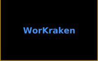</a><picture>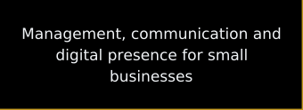</picture><picture>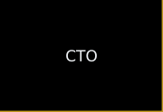</picture><picture></picture> 
<picture></picture><picture>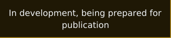</picture><picture></picture><picture></picture> 
<picture></picture><picture>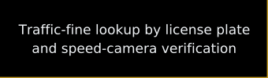</picture><picture></picture><picture></picture> 
<picture>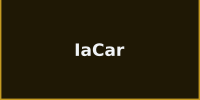</picture><picture>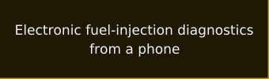</picture><picture></picture><picture>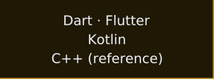</picture> 
<picture>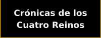</picture><picture>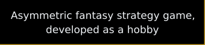</picture><picture></picture><picture></picture>

<!-- GOLD-GRID:END -->

<!-- WEBSITE:START -->
<h3 align="center"><picture>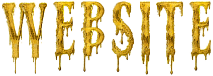</picture></h3>

  <picture></picture>

  

<!-- WEBSITE:END -->

<h3 align="center"><picture></picture></h3>

  <picture></picture>

  &nbsp;&nbsp;
  

  <picture></picture>

