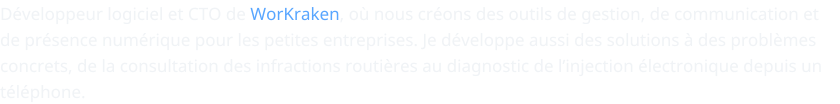
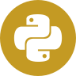
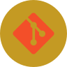
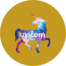
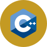
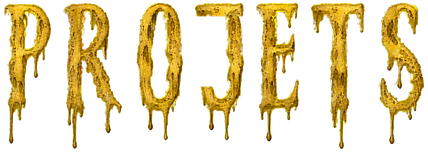
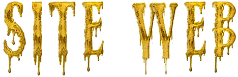
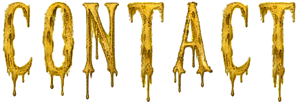

  
  
  
  
  
  

  <picture>
    <source media="(prefers-reduced-motion: reduce)" srcset="assets/tentaculo-portada-sin-movimiento.png" />
    
  </picture>

  <picture></picture> 
  <picture>
    <source media="(prefers-reduced-motion: reduce)" srcset="assets/hastur-linea-sin-movimiento.png" />
    
  </picture>

  <picture></picture>

  <picture></picture>

  <picture></picture>

  <picture></picture>&nbsp;
  <picture></picture>&nbsp;
  <picture></picture>&nbsp;
  <picture></picture>&nbsp;
  <picture></picture>&nbsp;
  <picture></picture>&nbsp;
  <picture></picture>&nbsp;
  <picture></picture>

  <picture></picture>&nbsp;
  <picture></picture>&nbsp;
  <picture></picture>&nbsp;
  <picture></picture>&nbsp;
  <picture></picture>&nbsp;
  <picture></picture>&nbsp;
  <picture></picture>&nbsp;
  <picture></picture>

<h3 align="center"><picture></picture></h3>

  <picture></picture>

<table align="center" width="100%">
  <thead>
    <tr>
      <th align="center" width="21%"><picture></picture></th>
      <th align="center" width="27%"><picture></picture></th>
      <th align="center" width="16%"><picture></picture></th>
      <th align="center" width="36%"><picture></picture></th>
    </tr>
  </thead>
  <tbody>
    <tr>
      <td align="center" width="21%"><strong><a href="https://github.com/Workraken">WorKraken</a></strong></td>
      <td align="center" width="27%">Gestion, communication et présence numérique pour les petites entreprises</td>
      <td align="center" width="16%">CTO</td>
      <td align="center" width="36%">Python&nbsp;·&nbsp;Jinja2&nbsp;·&nbsp;Uvicorn JavaScript&nbsp;·&nbsp;HTML/CSS Dart&nbsp;·&nbsp;Flutter Firebase&nbsp;/&nbsp;Firestore</td>
    </tr>
    <tr>
      <td align="center" width="21%"><strong>PostWik</strong></td>
      <td align="center" width="27%">En développement, publication en préparation</td>
      <td align="center" width="16%">Contributeur avec Soy-Red</td>
      <td align="center" width="36%">Python&nbsp;·&nbsp;JavaScript HTML/CSS&nbsp;·&nbsp;SQLite</td>
    </tr>
    <tr>
      <td align="center" width="21%"><strong>VialSYS</strong></td>
      <td align="center" width="27%">Consultation des infractions par plaque d’immatriculation et vérification des radars</td>
      <td align="center" width="16%">Créateur</td>
      <td align="center" width="36%">Python&nbsp;·&nbsp;JavaScript HTML/CSS Next.js&nbsp;·&nbsp;React</td>
    </tr>
    <tr>
      <td align="center" width="21%"><strong>IaCar</strong></td>
      <td align="center" width="27%">Diagnostic de l’injection électronique depuis un téléphone</td>
      <td align="center" width="16%">Créateur</td>
      <td align="center" width="36%">Dart&nbsp;·&nbsp;Flutter Kotlin C++&nbsp;(référence)</td>
    </tr>
    <tr>
      <td align="center" width="21%"><strong>Crónicas de los Cuatro Reinos</strong></td>
      <td align="center" width="27%">Jeu de stratégie fantasy asymétrique, développé comme loisir</td>
      <td align="center" width="16%">Créateur</td>
      <td align="center" width="36%">Dart&nbsp;·&nbsp;Flutter</td>
    </tr>
  </tbody>
</table>

<!-- WEBSITE:START -->
<h3 align="center"><picture></picture></h3>

  <picture></picture>

  

<!-- WEBSITE:END -->

<h3 align="center"><picture></picture></h3>

  <picture></picture>

  &nbsp;&nbsp;
  

  <picture></picture>

