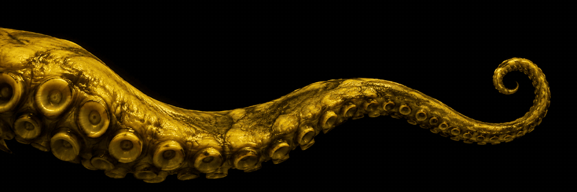

  

  

Desarrollador de software y CTO de [WorKraken](https://github.com/Workraken), donde construimos herramientas de gestión, comunicación y presencia digital para pequeños negocios. También desarrollo soluciones para problemas concretos, desde la consulta de infracciones de tránsito hasta el diagnóstico de inyección electrónica desde el celular.

En mi tiempo libre trabajo en un juego de estrategia en Flutter y paseo por Carcosa. 

     

##  Proyectos

|  |  |  |  |
| --- | --- | --- | --- |
| **[WorKraken](https://github.com/Workraken)** | Gestión, comunicación y presencia digital para pequeños negocios | CTO | Web / móvil |
| **PostWik** | En desarrollo, en proceso de subida | Colaborador junto a Soy-Red | JavaScript |
| **VialSYS** | Consulta de infracciones por patente y verificación de cinemómetros | Autor | Python |
| **IaCar** | Inyección electrónica desde el celular | Autor | Dart / Flutter |
| **Crónicas de los Cuatro Reinos** | Juego de estrategia asimétrica de fantasía, hecho como hobbie | Autor | Flutter |

##  Contacto

 

  

