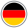
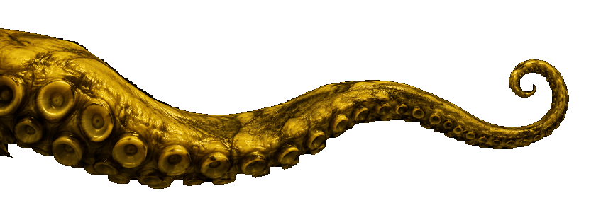

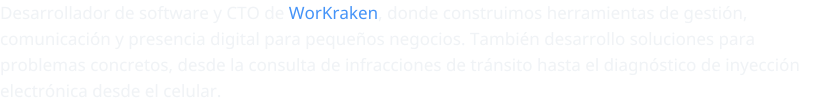
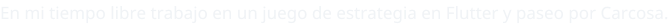
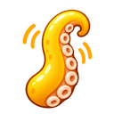
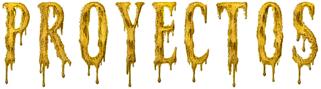
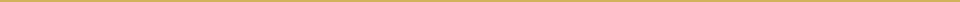
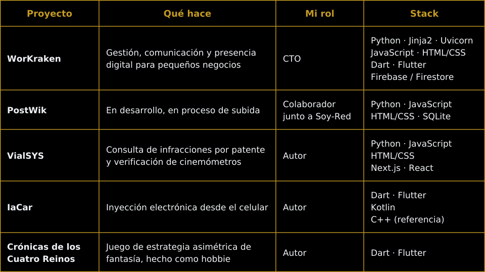
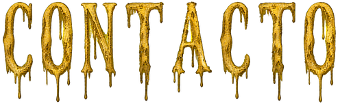

  
  
  
  
  
  

  <picture>
    <source media="(prefers-reduced-motion: reduce)" srcset="assets/tentaculo-portada-sin-movimiento.png" />
    
  </picture>

   
  <picture>
    <source media="(prefers-reduced-motion: reduce)" srcset="assets/hastur-linea-sin-movimiento.png" />
    
  </picture>

  

   

     

<h3 align="center">&nbsp; </h3>

  

  

<h3 align="center">&nbsp; </h3>

  

  &nbsp;&nbsp;
  

  

